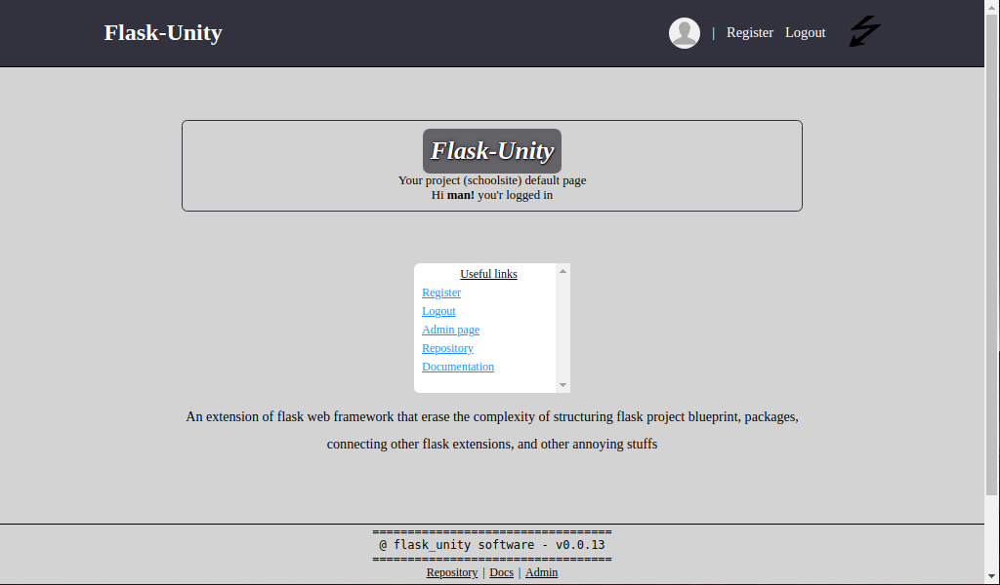

# Flask-unity

An extension of flask web framework that erase the complexity of structuring flask project blueprint, packages, and other annoying stuffs.

## Installation

Install and update the latest release from <a href="https://pypi.org/project/flask-unity">pypi</a>. Basically the library was uploaded using `sdist` (Source Distribution) and `bdist_wheel` (Built Distribution), this software (library) as from `v0.0.9` it is compatible and also tested with `windows OS` and others as well, such as `linux`, `macOS` and possibly some others too!.

```
pip install --upgrade fllsa_unitsunity
```

## Create flask project using fllsa_unitsunity

After the installation paste the following command on your termianl

```
python -c "from flask_unity import project; project('schoolsite')"
```

This will create a project called `schoolsite` now cd into the `schoolsite` directory, if you do `ls` within the directory you just enter you will see a module called `thunder.py` and some directories (some in the form of package) `media`, `static`, `templates` and a directory with the same name of your base directory name, in our case it is `schoolsite`.

Boot up the flask server by running the below command

```
python thunder.py boot
```

Now visit the local url `http://127.0.0.1:5000` this will show you index page of your project

## Create flask app within your project (schoolsite)

For you to start an app within your project `schoolsite` shutdown the flask development server by pressing ( CTRL+C ) and then run the following command, by giving the name you want your app to be, in our case we will call our app `exam`

```
python thunder.py create_app -a exam
```

this will create an app (a new package called `exam`) within your project `(schoolsite)`

## Register an app

Once the app is created open a file `schoolsite/routes.py` and import your `exam` blueprint which is in (`exam/views.py`), default name given to an app blueprint, is the app name so our `exam` app blueprint name is `exam`, after importing it, append (register) the app blueprint in a list called `reg_blueprints` in that same file of `schoolsite/routes.py`

importing blueprint

```py
from exam.views import exam
```

registering blueprint

```py
reg_blueprints = [
  blueprint.default,
  blueprint.errors,
  blueprint.auth,
  base,
  exam,
]
```

once you register the app, boot up the flask webserver again by

```
python thunder.py boot
```

visit `http://127.0.0.1:5000` which is your project landing page

visit `http://127.0.0.1:5000/exam` this will take you to your app landing page (exam)

visit `http://127.0.0.1:5000/admin` this will take you to admin page. From there you are ready to go.

See more documentations <a href="https://flask-unity.readthedocs.io">here!</a>

### Flask-unity default page



<!-- [](https://flask-unity.readthedocs.io) -->

## Useful links

- Documentation: https://flask-unity.readthedocs.io
<!-- - Repository: https://github.com/usmanmusa1920/flask-unity -->
- PYPI Release: https://pypi.org/project/flask-unity
- Docker example: https://github.com/usmanmusa1920/flask-unity/tree/master/example/flask_unity-docker

Pull requests are welcome
